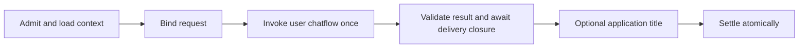

# Embedded chat core

`mf-chat` owns SQLite storage and application-level conversation orchestration. Direct database APIs
and application-owned `mf_chat.*` nodes use the same storage handlers. The library does not initialize
a terminal or launch workflow runner processes.

A conversation has two independent views:

- **Conversation transcript:** append-only original submissions and generated assistant/tool records,
  used for audit and terminal presentation.
- **Model context:** a revisioned continuation selected by the user Flow. It can append a normal
  exchange or replace the complete context without editing any displayed history.

This is an incompatible chatflow protocol update. Update and recompile older chat executables; there
is no fallback from scalar `text` results or separate `prompt`/`system`/`history` conversation inputs.
Existing databases receive forward migrations that preserve historical messages and accounting.

## Database initialization

Open an explicit database path:

```rust
let database = mf_chat::ChatDatabase::open("state/chat.sqlite")?;
println!("{}", database.path().display());
```

The owner creates parent directories, acquires an exclusive sibling lock, applies embedded pending
migrations, and keeps the lock until dropped. Another owning host receives a typed busy error.
Initialization enables WAL, foreign keys, and a finite busy timeout. No external migrations or tools
are needed. Preparation validates node contracts without opening storage; `ChatError` retains typed
filesystem, connection, query, migration, and transcript-validation sources.

Records distinguish sessions, ordered messages, turns, application invocations, and reported model
calls. One invocation can report several Agent, compaction, and title calls without treating tools or
summary messages as extra model attempts. Schema rollback is a development operation on disposable
databases; a downgrade that cannot represent tool records or replacement checkpoints is rejected.

## Sessions and history

Database APIs invoke storage handlers directly, without executing workflows:

```rust
let session = database.create_session("default", Some("Answer briefly".into()), None)?;
database.rename_session(&session.id, "Project questions")?;
database.archive_session(&session.id)?;
database.restore_session(&session.id)?;
let sessions = database.list_sessions(false, 50, None)?;
let transcript = database.messages(&session.id, 50, None)?;
let model_context = database.model_context(&session.id)?;
```

Lists use bounded keyset pages. Pass `next_after` back as the cursor. Session order is creation time
followed by stable ID; message order uses a checked per-session sequence. A turn can have any number
of assistant and tool messages, including repeated roles. Message records carry turn state and
turn-level usage facts. Pages can begin or end inside a tool exchange.

`messages()` reads original conversation records, including unsuccessful submissions and valid
failed display prefixes. `model_context()` separately returns `{revision, messages}` for the currently
published continuation. It is not a bounded transcript page and does not reconstruct context from
all successful audit messages after a replacement.

A new session seeds its context from its initial system instructions. Migration seeds existing
sessions from those instructions and successful legacy exchanges exactly once. A replacement can
edit or remove system instructions; later requests do not reinsert `session.system`. Archiving keeps
all records but prevents new turns until restoration.

Registered kinds include `mf_chat.session.create`, `.list`, `.load`, `.rename`, `.archive`, `.restore`,
`mf_chat.messages.list`, and `mf_chat.context.load`. The former `history()` API and
`mf_chat.history.load` are removed. All node inputs name an explicit database path.

## Shared conversation contract

### Inputs

`ConversationInputs.messages` contains the admitted complete model context followed by exactly the
current user submission. A chatflow declares one unambiguous required `messages: List(Object)` startup
port. Its qualified name can belong to any startup node, such as `params.messages`. The host, not
terminal configuration, binds this input.

The optional application-owned `context: Object` startup port receives title policy and the admitted
model-context revision:

```json
{
  "title": {
    "source": "provisional",
    "revision": 0,
    "attempted": false,
    "enabled": true
  },
  "model_context": {"revision": 3}
}
```

A Flow need not declare context, model, endpoint, or credential ports to be a valid chatflow.
Remaining startup ports are ordinary workflow configuration. Resolve their defaults and environment
bindings before admission; caller configuration cannot override application-owned conversation inputs.
Stdin-dependent chat executables are rejected.

### Alternative terminal outputs

A Flow advertises `append`, `replace_context`, or both. Each selected output is a self-contained
result object with its own `status`, `usages`, optional `error`, optional `title`, and variant-specific
message lists. Output names are the wire tags: no `kind` field, `update` wrapper, or merge node is
required.

A normal result exports only newly generated additions:

```json
{
  "append": {
    "status": "succeeded",
    "messages": [
      {"role": "assistant", "content": "The answer is 42."}
    ],
    "usages": []
  }
}
```

The next context is the admitted request, including its current user, plus `append.messages`. Do not
echo the incoming request. A Flow can preprocess a private provider request, but returning `append`
still continues from the original admitted context; the host does not infer a rewrite.

A replacement supplies a complete continuation and independent original display additions:

```json
{
  "replace_context": {
    "status": "succeeded",
    "context_messages": [
      {"role": "system", "content": "Summary: the calculated result was 42."}
    ],
    "display_messages": [
      {"role": "assistant", "content": "The answer is 42."}
    ],
    "usages": []
  }
}
```

The host publishes `context_messages` exactly, including `[]`. It does not append the current user,
final assistant, or display delta to that snapshot. A snapshot may omit them, summarize current tool
output, reorder or edit context, or coherently rewrite tool-call IDs. The UI appends only
`display_messages` and never displays the replacement as chat history.

For direct conditional branches, use existing optional output selections:

```json
{
  "outputs": [
    {"name": "append", "node": "normal", "port": "value", "optional": true},
    {"name": "replace_context", "node": "compact", "port": "value", "optional": true}
  ]
}
```

Both selections must be optional when both are advertised. Exactly one must actually be produced
per invocation. Zero, both, repeated results, undeclared alternatives, null/nonobject payloads,
missing required facts/lists, and unknown payload fields fail validation. A later conflicting result
invalidates the earlier recovery candidate; the host must not save the first arrival. Empty lists
are values, not absent outputs. Manifests do not describe payload schemas, so capture decodes and
validates fields even after preflight succeeds.

Rust backends return `ConversationResult { status, update, usages, error, title }` with
`MessageUpdate::Append` or `MessageUpdate::ReplaceContext`. This enum is host-internal normalization,
not an author-side Flow protocol. Its native codecs and canonical JSON use the same named output
objects, including inside `Completion.result` and retained recovery state.

### Messages and validation

Both views reuse `mfn_llm::ChatMessage`, `ToolCall`, and `ToolResult`; there is no chat-specific message
schema. Roles are `system`, `user`, `assistant`, and `tool`. Only assistant messages carry
`tool_calls`; tool results carry `tool_call_id`. Arguments remain arbitrary JSON in records, although
Agent dispatch requires an object compatible with the selected tool interface.

```json
[
  {
    "role": "assistant",
    "content": "",
    "tool_calls": [
      {"id": "lookup-1", "name": "lookup", "arguments": {"key": "a"}},
      {"id": "lookup-2", "name": "lookup", "arguments": {"key": "b"}}
    ]
  },
  {"role": "tool", "tool_call_id": "lookup-2", "content": "B"},
  {"role": "tool", "tool_call_id": "lookup-1", "content": ""},
  {"role": "assistant", "content": "Finished checking."}
]
```

Assistant call batches may have empty content; tool results may also be empty. Parallel results can
arrive in either order but must resolve their matching unique pending IDs. Ordinary user/system
messages and assistants without calls need nonempty content. Unknown role-specific fields, duplicate
or orphan IDs, interleaved unresolved batches, and missing results in a complete view are rejected.

A successful result requires a complete display exchange ending with a nonempty assistant answer
without calls, and an absent or empty error. A failed result requires a nonblank error and no title;
its display delta can be empty or a valid partial prefix with unresolved calls only in the final
batch. It may retain earlier complete rounds. A replacement snapshot must always be complete,
even for a failed result. Display and snapshot validation are independent: the same exchange can
appear in both without being mistaken for duplicate calls across one transcript.

A failed result can therefore preserve original tool records for audit while publishing no context:

```json
{
  "append": {
    "status": "failed",
    "messages": [],
    "usages": [
      {"call_id": "request-1", "model": "example-model", "error": "Provider unavailable"}
    ],
    "error": "The final model request failed"
  }
}
```

Set `capture_errors: true` on LLM nodes that should report request failures as data. Configuration,
input, cancellation, and infrastructure errors can still abort before any terminal result. Previews
and observations are never substitutes for missing messages or usages.

## Turn lifecycle

`mf_chat.turn.begin` atomically stores the original user, running turn and application invocation,
admitted context revision, and advertised alternatives when contract-backed. It reserves one user
sequence and loads the complete admitted context before releasing its short transaction. Only one
turn runs per session; other sessions can progress while a provider is pending.

`mf_chat.turn.complete` validates against that immutable admission, appends every display message
with checked sequence allocation, and saves the complete canonical result, usages, and terminal
state together. Successful settlement also publishes the derived context revision and applies an
eligible title in that transaction. Failed results save their valid display prefix and facts but
publish neither context nor title.

Context publication compares-and-swaps the admitted revision. A stale successful update fails
without partial messages, facts, or title writes; save-only retry cannot silently rebase it. Title
revision is independent, so a concurrent manual rename preserves its title without blocking valid
context publication. Append revisions reference the original exchange; replacement checkpoints
contain their exact full snapshots.

Replay compares the complete canonical result, including variant, both replacement lists, error,
title, metadata, and usages. Identical replay returns the stored completion before attempting CAS.
It never republishes an old context after later turns. Different data for the same identity conflicts.

`mf_chat.turn.fail` and `mf_chat.call.fail` finalize work without a terminal result and cannot
overwrite committed data. Operational error summaries are bounded; canonical result errors remain
complete. `mf_chat.turn.load` and `mf_chat.call.load` expose individual records for inspection.
Opening a database under its ownership lock marks abandoned running work interrupted, without
automatically resending requests or rebuilding context from previews.

## Embedded conversation host

`ChatHost` owns database access, profiles, admission limits, execution workers, and abort cleanup.
Each submission executes the application-owned conversation Flow:


```mermaid
flowchart LR
    Admit["Admit and load context"] --> Bind["Bind request"]
    Bind --> Invoke["Invoke user chatflow once"]
    Invoke --> Validate["Validate result and await delivery closure"]
    Validate --> Title["Optional application title"]
    Title --> Settle["Settle atomically"]
```

Finite and compatible TaskStream graphs are composed through `workflow.call`; preparation binds
native values and completion reads the produced alternative after call success. An inactive optional
port must not skip settlement. Graphs requiring a native Event/Stream coordinator use the host-bound
`mf_chat.workflow.invoke` adapter. Both paths share cancellation, result validation, and storage.
The host drains declared streams even without a preview subscriber.

The user Flow owns business generation, tools, compaction thresholds, summary requests, explicit
usage composition, and captured-failure policy. The application does not insert Agent/tool/compact
branches, identify internal model nodes, or collect hidden model usage. Resource management and
abort cleanup remain host responsibilities outside the Flow success graph. Save-only retries call
storage directly, never the conversation Flow.

```rust
let profile = mf_chat::WorkflowProfile::from_path(
    "default",
    "examples/chat-title-flow.json",
    Default::default(),
)?;
let host = mf_chat::ChatHost::open("state/chat.sqlite", mf_chat::HostConfig::new(profile))?;
let session = host.database().create_session("default", Some("Answer briefly".into()), None)?;
let mut job = host.submit(&session.id, "Hello")?;
let identity = job.invocation().clone();
while !job.poll() {
    std::thread::sleep(std::time::Duration::from_millis(10));
}
let completion = job.join()?;
host.close()?;
```

`poll` is nonblocking; `join` waits and reports failed business status as an error after its audit
result is stored. `cancel` requests cooperative cancellation. Dropping a job cancels it; closing or
dropping the host cancels and joins workers before releasing storage ownership. The default host
admits four active workflows independently of the runtime domain limit. Busy sessions and capacity
limits produce explicit admission errors.

Profiles contain resolved configuration or an injected `ConversationBackend`. Environment bindings
resolve during profile construction; model-specific references remain user-Flow policy. An optional
observer receives application and nested user execution. Run the supplied two-turn host example with
model configuration and credentials available:

```sh
OPENAI_API_KEY=your-key nix develop --command cargo run -p mf-chat --example conversation -- state/chat.sqlite examples/chat-title-flow.json
```

## Session title summaries

Title composition is optional. When policy permits it and unique resolved `model`, `base_url`, and
`api_key` inputs exist, the host can call `mf-chat.chat-title`. An empty key supports keyless endpoints.
Missing or ambiguous provider inputs skip this composition rather than invalidating a chatflow.
Defaults, environment bindings, and secret markers are preserved.

The call is eligible only for a successful result and an eligible provisional title, without a
returned title or a reported title attempt. A branch's `title` is a candidate; usages attributed to
`title` also suppress duplicate work. A separate root `title` output is not an ownership hint and
cannot supply a missing branch field. `HostConfig::automatic_titles = false` disables application
composition. Custom backends can opt in through `builtin_title_parameters`.

The source is the admitted original user and final assistant in the **display delta**, never tool
text, preambles, or replacement context. Empty and summary-only snapshots therefore do not hide the
answer from title generation. Title-model messages are not added to either conversation view.
Conversation and title usages settle together; title provider failure preserves the primary result
and records the attempted call. There is no background title queue, implicit retry, or startup job scan.

The [title example](../examples/chat-title-flow.json) expresses its own policy using `context.title`.
The [nested title example](../examples/chat-nested-title-flow.json) calls the reusable title Flow and
combines usages. See [reusable Flows](workflows.md#reusable-flows) for that helper's separate interface.
Neither example needs a root title output.

The terminal uses the first prompt line as a provisional name. `create_provisional_session` provides
the same behavior programmatically; an explicit title passed to `create_session` is manual. Manual
names take precedence. Title candidates are trimmed, nonempty, free of control characters, and at
most 120 characters. Invalid or stale candidates do not prevent saving the main result. The original
candidate remains in the canonical result for replay; read the saved session for the applied title.

## Tool Agents and context replacement

The [calculator example](../examples/chat-calculator-flow.json) calls the fixed `mfn-llm.agent` Flow
with a complete `params.messages` request, `Map(Flow)` tools, and matching `Map(Object)` properties.
It supports addition, subtraction, multiplication, and division. A normal `builtin.object` assembles
Agent `status`, generated `messages`, `usages`, and `error` into the single `append` output.

The [DeepSeek web Agent](../examples/chat-deepseek-flow.json) uses the same contract with separate
Search and Fetch tool Flows. The model can issue parallel searches and fetch discovered pages in later
rounds. Its root parameters separate `llm_model`, `llm_base_url`, and `llm_api_key` from
`deepseek_base_url` and `deepseek_api_key`. Keys can come from `OPENAI_API_KEY` and `DEEPSEEK_API_KEY`
or explicit CLI arguments. Each tool Flow binds its DeepSeek settings with context templates in the
producing Flow constant's `config.inputs`; only unconfigured public inputs become model arguments.
No Agent-specific argument channel or hidden child environment lookup is required. Network-bound
Search and Fetch nodes also make the nested execution PiPs easier to observe than the calculator's
short local operations. See [configured Flow tools](workflows.md#configured-flow-tools) for setup,
provider charges, and latency limitations.

The Agent accumulates assistant call batches, ordered parallel tool results, and the terminal
assistant without echoing the admitted request. Captured failures and iteration limits retain
completed rounds and usages. `answer` remains an optional stream of assistant text, including tool
preambles; it does not carry a live tool lifecycle protocol. Catalog projection runs once before the
first model call. See [configured Flow tools](workflows.md#configured-flow-tools).

Checked tool-operation failures, such as a DeepSeek Fetch HTTP 404, are returned to the model as tool
results rather than interrupting the whole Agent. The failed exchange remains in the transcript;
any subsequent request is an explicit model decision, not a hidden provider retry. Runtime and
cancellation failures still stop execution.

The [context example](../examples/chat-context-flow.json) reuses that calculator chatflow and exposes
two independent optional result outputs, with no convergence node:

- Normally it forwards the calculator's self-contained `append` result, including captured failures.
- With `params.compact = true` after successful generation, it explicitly calls a summary model on
  the admitted context and this turn's generated tool exchange. `replace_context` returns only the
  summary system message as continuation and the untouched Agent additions as display messages.
- The replacement branch reports both Agent usages and the additional `compaction` usage. Failed,
  incomplete, or empty summaries produce a failed audit result with the original display records;
  they do not clear or replace active context and are not retried automatically.

```sh
mf compile examples/chat-context-flow.json --output target/chat-context
mf run ./target/chat-context --chat --params.model your-model --params.compact true
```

The flag is example business policy, not a host compaction scheduler. Real flows can use their own
thresholds or summary strategies. The example's CEL assembly has the ordinary Code limits: 1 MiB
serialized inputs/outputs, 10,000 collection entries across conversion, and 16 nesting levels. Large
inputs fail explicitly instead of silently dropping history. Configure a different business pipeline
when those limits are inappropriate.

## History metadata

Every message can carry opaque object-valued `metadata`, including nested values and nulls:

```json
{
  "role": "assistant",
  "content": "See the referenced document.",
  "metadata": {"citations": [{"uri": "https://example.com/reference"}], "note": null}
}
```

Metadata is omitted from provider requests. Display records keep their original content, call IDs,
arguments, result strings, and metadata through save-only retry, paging, and reopen. Context edits
change only the continuation copy. New user submissions currently have no metadata.

Native and JSON codecs share the `mfn-llm` field schema and reject duplicate JSON keys at external
byte boundaries. Serialization persists business values, including secret payloads; it is not a
redaction or encrypted-storage boundary. Native Flow capabilities cannot be persisted as message
arguments or metadata. No placeholder or alternative message schema is introduced for them.

## Usage statistics

Use `ChatDatabase::usage`, `ChatHost::usage`, or `mf_chat.usage.query`. Queries read committed facts
in one SQLite snapshot and never execute a model or change billing records:

```rust
let statistics = host.usage(mf_chat::UsageQuery {
    session_id: Some(session.id.clone()),
    purpose: Some(mf_chat::CallPurpose::Conversation),
    group_by: Some(mf_chat::UsageGrouping::Model),
    limit: 50,
    ..Default::default()
})?;
```

Each `usages` entry identifies one actual model attempt, including attempts without token counters.
Optional nonblank `attribution.purpose` and `attribution.profile` labels are independent of the owning
workflow profile and do not select providers or credentials. Missing labels fall back to invocation
purpose/profile. Explicit labels such as `title` and `compaction` preserve separate accounting.

Flows combine the exact lists they intend to report. Duplicate call IDs within a result are rejected.
The application does not infer attempts from tool messages, configured model hints, or observations.
An explicit empty list reports zero calls; an invocation with no terminal list remains unreported,
not confirmed zero. `unreported_invocations` exposes that uncertainty. Known legacy single-model
facts remain queryable; new writes leave scalar compatibility columns empty.

Filters accept session, profile, actual model name, purpose, and UTC Unix-millisecond start times;
start is inclusive and end exclusive. Group by session, model, profile, purpose, or UTC day. Group
pagination leaves the overall summary scoped to the complete filter. Every token counter exposes
`known_subtotal`, `reported_calls`, and `missing_calls`: absent is unknown, explicit zero is reported,
and partially reported subtotals are not complete totals. SQL aggregation detects integer overflow.

`mfn_llm::CallUsage` contains provider call facts. `mf_chat::CallUsage` adds event-derived
`timing.elapsed_us` and optional `timing.first_token_us` without changing their flat JSON shape.
The LLM emits `llm.request.started`, `llm.response.first_text`, and `llm.request.finished`; observation
stamps source Unix nanoseconds once. The first-text event precedes publication and backpressure;
empty or metadata-only events do not count. The application correlates call IDs and derives
microsecond differences. Executable chat receives the same events through OTLP before settlement.
Missing, conflicting, or noncausal sequences stay unknown; receiver arrival time is not substituted.
Raw standalone node outputs do not compute application timing.

`CallUsage::token_rates()` derives generation throughput from the saved output-token count divided
by duration after FTT, and end-to-end throughput from whole duration. These are client-observed rates,
including local backpressure, not server-only decoding measurements. Missing counters, failed calls,
and zero-duration windows remain unknown. Paired zero tokens yield zero over a positive duration.
Persistence retries preserve original timing rather than recalculating it.

Overall and group `performance` summaries expose elapsed/first-token totals and means, plus weighted
paired-token rates. Each includes reported/missing coverage. Aggregation sums paired tokens and
positive durations rather than averaging per-call rates. Monetary estimates need separate pricing.

A turn displays one dim footer, for example `FTT 500ms · Gen 66.7 | E2E 50.0 tok/s`. Narrow views
prioritize FTT and generation throughput. Multiple calls show mean FTT, coverage, and weighted rates;
unknown values stay `—`. Conversation and unlabeled calls contribute; other explicit purposes do not.
Message pages attach required facts once per visible turn, including pages starting with a tool
result. Rendering and reload never multiply charges by message count. Retained results keep the same
facts. `UsageSummary::from_calls` shares persisted aggregation rules.

## Optional live answer subscriptions

`ChatHost::submit` and `retry` allocate no stream receiver. Subscribe before launch with
`submit_stream` or `retry_stream`, and drain concurrently with completion:

```rust
let (job, events) = host.submit_stream(&session.id, "Hello")?;
let reader = std::thread::spawn(move || {
    while let Ok(event) = events.recv() {
        render_provisional(event);
    }
});
let completion = job.join()?;
reader.join().expect("reader panicked");
```

The public `answer` output contains `text` and `model_call_id`. It is selected through ordinary Flow
outputs independently of internal node kinds. An application `Invocation.call_id` is not a model
call ID; one turn can contain many model calls. A model can emit no fragments. Normal stream drain
and execution closure establish completion, not a special chat transport envelope.

Subscribed previews retain delivery receipts until consumed. Dropping a receiver with pending output
fails delivery; shutdown interrupts blocked publishers. A completed job does not cancel closed
output. A valid terminal result retained before final drain remains available for explicit save-only
recovery if drain fails. Text prefixes alone never become database messages or usage facts.

Tool-aware chatflows may select the shared Agent's optional `tool_call_delta` stream. Each event
contains a raw `arguments` fragment, its `model_call_id`, and the provider tool `index`, with optional
`id` and `name` hints when sent with that fragment. A fragment need not be valid JSON on its own.
`PreviewEvent.delta` distinguishes `PreviewDelta::Text` from `PreviewDelta::ToolCall`. Neither enters
history or model context. The calculator, context-replacement, and DeepSeek examples explicitly
select `tool_call_delta`. A chatflow can select it without exposing `answer`.

Terminal preview capture runs independently of drawing and inspection. It keeps at most 32 text/tool
entries and 128 KiB of UTF-8 data, including correlation metadata, with an explicit truncation notice
while continuing to drain and validate.
A complete result replaces provisional segments with its display delta. Prefixes without a valid
result stay visibly unfinished. Older invocation events cannot alter the active turn.

## Executable conversation backend

`ChatContract` validates the external startup/result interface, not internal model counts, graph
layout, loops, or business policy. `mf run runner --chat` registers the frozen executable as
`mf-chat.runner` and calls it through the same application lifecycle. Opening chat and submitting
turns do not rebuild the executable or load original Flow sources. Provider configuration travels
through a private argument file. The supervisor owns child execution, cancellation, and observation.

Finite executables keep terminal JSON. Native streaming executables use JSONL with optional `answer`
records and exactly one complete alternative result. Capture validates the whole invocation and
retains the candidate until normal closure. A later conflicting result invalidates recovery rather
than preserving a first-result winner. Unrelated workflow outputs do not supply missing result facts.
Result capture is bounded by `MAX_RECOVERY_BYTES` (16 MiB).

The [single-call](../examples/chat-flow.json), [title](../examples/chat-title-flow.json),
[loop](../examples/chat-loop-flow.json), [calculator](../examples/chat-calculator-flow.json), and
[context-replacement](../examples/chat-context-flow.json) examples compile directly. The loop
forwards `chat.delta` through `config.stream_outputs.answer` while accumulating all generated
assistants and usages. Private loop context is distinct from its exported additions.

## Persistence and recovery

`mf_chat.conversation.finish` composes optional title facts and invokes shared settlement. Host abort
cleanup and save-only retries use those handlers directly, independently of a cancelled execution
context. Direct callers can begin an `Invocation`, bind its request with `contract.arguments`, then
pass typed data to `reconcile_result` or bounded JSON to `reconcile_completion`.

Recovery uses the admitted revision, original user, and stored advertised alternatives. It needs no
current manifest, source files, or workflow execution. `CompletionState::Committed` means a terminal
result is durable, whether business status succeeded or failed. `Uncommitted` retains the complete
candidate and identities, including failed prefixes and both replacement lists. `save_recovered` or
`ChatHost::retry_completion` performs storage only. Failed candidates never publish context. A stale
successful candidate cannot rebase; repeated writes remain idempotent. Explicit abandon finalizes
unfinished work without publishing the candidate.

Fresh model retry is different: it creates new turn/application IDs, links `retry_of`, and uses the
current published context. It may execute tools again. Cancellation and storage rollback do not undo
external tool effects; neither fresh retries nor crash recovery promise exactly-once tool execution.
No operation implicitly resumes an Agent or reruns a summary/title stage. A crash before durable
settlement can lose a reply and completed-call facts; interrupted work remains unknown rather than
inventing a partial successful exchange.

## Executable chat terminal

Compile a conversation workflow and launch it:

```sh
mf compile examples/chat-calculator-flow.json --output target/chat-calculator
mf run ./target/chat-calculator --chat --chat-profile default --params.model your-model
```

Storage defaults to `~/Library/Application Support/miniflow/chat.sqlite` on macOS and
`$XDG_DATA_HOME/miniflow/chat.sqlite` on Linux, falling back to `~/.local/share/miniflow/chat.sqlite`
when the variable is unset, empty, or relative. Use `--chat-db <PATH>` to override it. Help displays
the resolved path without creating storage; unavailable user directories require an explicit path.
`--chat` implies `--tui`, and both flags can be passed together.

A new conversation is persisted only after its first submission. Resumed conversations keep their
published context; original records remain visible after compaction. Each tool result is shown under
its matching call on the current page, regardless of result arrival order. A page without the call
still shows the result with its tool-call ID. Grouping changes only the display, not stored order.
Tool arguments and results are inert literal data, never prompts, Markdown images, or commands.
Live tool previews display argument fragments, not tool execution state. Authoritative results start
collapsed (`[+]`) and show `[-]` when expanded. The marker leads the result header so it stays visible
when a long ID wraps. Expansion is keyed by turn and call ID and survives save and reload.

Assistant text supports Markdown in saved records, previews, and retained results: headings, emphasis,
lists, tasks, quotes, links, tables, and code blocks. Headings show explicit levels `#1` through `#6`.
Fenced blocks use their language for highlighting; unsupported languages, very long code lines, and
highlighting errors fall back to plain code. HTML, prompts, diagnostics, and tool data stay literal.
Terminal controls are escaped without modifying stored content.

Unchanged Markdown blocks and wrapped lines are cached. Resize reflows without repeating highlighting;
streaming highlighting resumes from complete lines. Scrolling up anchors content, while scrolling
to the bottom resumes tail following. The input grows with content; Unicode editing and bracketed
paste are supported, with a 256 KiB editor limit.

Assistant Markdown images support local paths and `file:`, `http:`, and `https:` PNG/JPEG/WebP. Paths
resolve against the initial working directory. Loading occurs in the background on viewport entry,
with 8 MiB and 4-megapixel limits and bounded caching. A new execution or settlement refreshes images.
Ghostty/Kitty use the Kitty protocol with placeholders; other terminals use colored half-blocks.
Detection reads terminal environment and dimensions, never consumes keyboard input or probes stdout.
Images fit within 120 columns and 40 rows, clip while scrolling, hide behind popups, and release
resources on session change, eviction, or exit.

| Interaction | Key |
| --- | --- |
| Send the prompt | Alt+Enter, or Esc then Enter |
| Insert a newline | Enter while editing |
| Browse messages / return to editing | Esc / i |
| Open commands | Ctrl+P |
| Toggle execution panel | Ctrl+E |
| Select next / previous tool result while browsing | Tab / Shift+Tab |
| Expand / collapse selected tool result | Space while browsing, or Ctrl+T |
| New chat / switch saved chat | Ctrl+N / Ctrl+S |
| Cancel current execution | Ctrl+C |
| Quit after cleanup | Ctrl+Q |

Pickers use arrows and Enter; Esc closes them. Save/discard actions operate on the retained full
result without running generation. Unsaved display additions remain visible across user-only reloads;
context replacement is marked pending, not published. Failed records stay visibly unsuccessful,
including failed results with tool records or no assistant answer. Saving a failed audit result does
not publish its snapshot. A retry action starts a fresh execution and may repeat tool effects.

Session switching waits for active or retained work to be resolved. Extra submissions are rejected,
not queued. Drafts survive idle switches. History opens at a bounded latest page; Earlier/Latest
commands page original records, not model context. Turn-level performance appears once per page and
is not duplicated on reload.

The Flow panel is enabled by default. Wide terminals place it beside the transcript, narrower tall
terminals below, and small terminals show a status line. Ctrl+E does not stop observation and its
preference survives new turns/sessions for the application run. Parallel work uses the shared local
picture-in-picture graphs, including members inside folded calls. The last run remains visible until
a new turn or session; Inspect opens graph, trace, log, and data views and Esc returns to chat.

The terminal has no rename, archive, usage-dashboard, automatic-title, or parallel-execution controls;
those remain programmatic APIs or Flow policy. Storage and supervision run on a worker so drawing
and cancellation stay responsive. Quit cancels and reaps children, reconciles retained work, releases
ownership, and never prints turn JSON to stdout. Handled turn failures allow normal exit; display or
cleanup failures return status 1. Unsaved results are memory-only and are not resent after restart.
